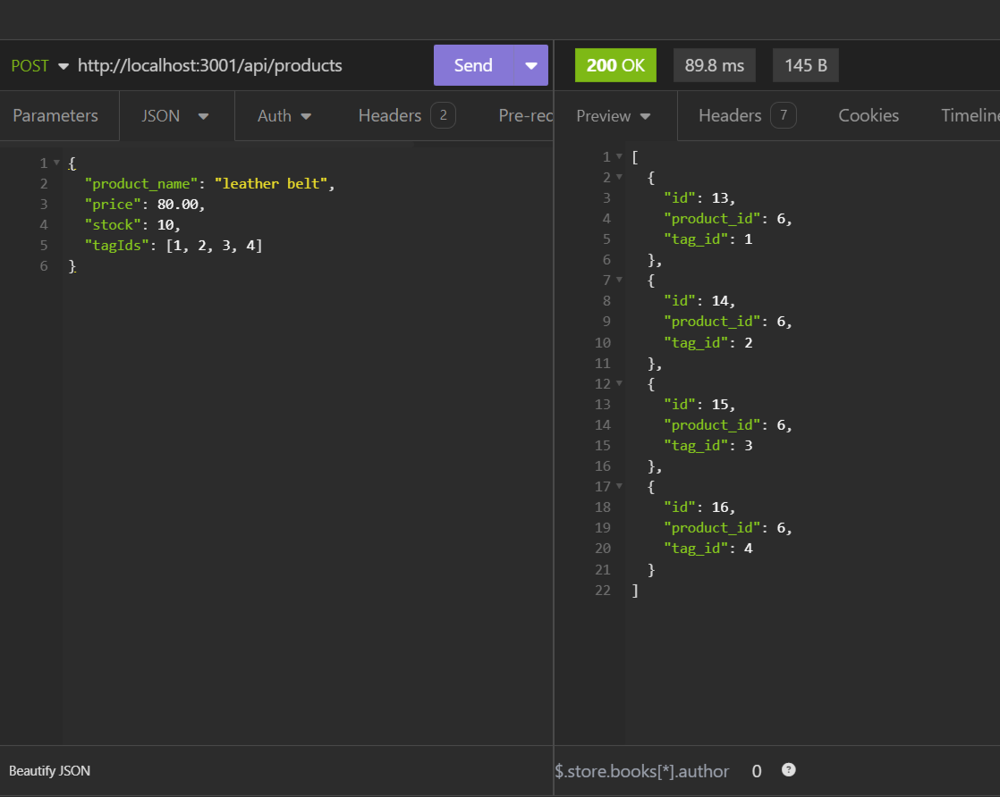
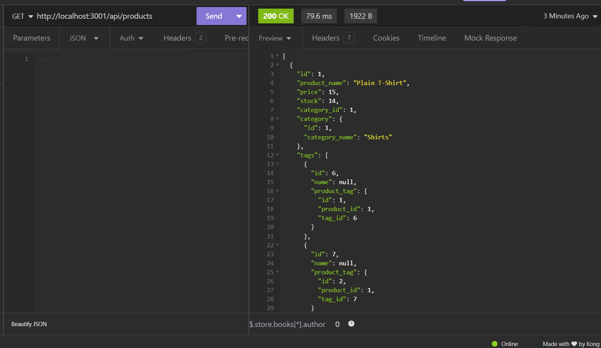

# E-commerce Back End

## Description

For this challenge, I modified starter code to use Sequelize to interact with a MySQL database. The Express.js API was already working when this code was given to students, so I created models (extending the base Model provided by Sequelize) and wrote the API routes. This is a back end project only so you must interact with it using Insomnia. It is not currently deployed as a live website.

## Table of Contents

- [Installation](#installation)
- [Usage](#usage)
- [Credits](#credits)
- [License](#license)

## Installation

To run this project you will need to have:
- Git Bash (Windows)/Terminal (Mac)
- Node.js
- MySQL

Clone the repository to your local device and navigate to the directory that contains the repository using Git Bash/Terminal. 

Run `npm i` to install the required dependencies, including Inquirer. Then open the MySQL shell, log in, and run the command `source db/schema.sql;` to start and seed the database. Exit the MySQL shell and run `npm run start` to start the server and then open Insomnia to test the routes.

## Usage

You can see a video of me testing the API routes via Insomnia [here](https://screenrec.com/share/V2nptkKed1)

## Known Issues

- Update Employee Role prompt does not work
- Giving employees a manager causes seed to fail, so no employees have a manager

## Credits

This project features code heavily modified from a class activity for the SQL week of class.

## License

This project is licensed with the MIT license 2024 by Jessica Jones
---